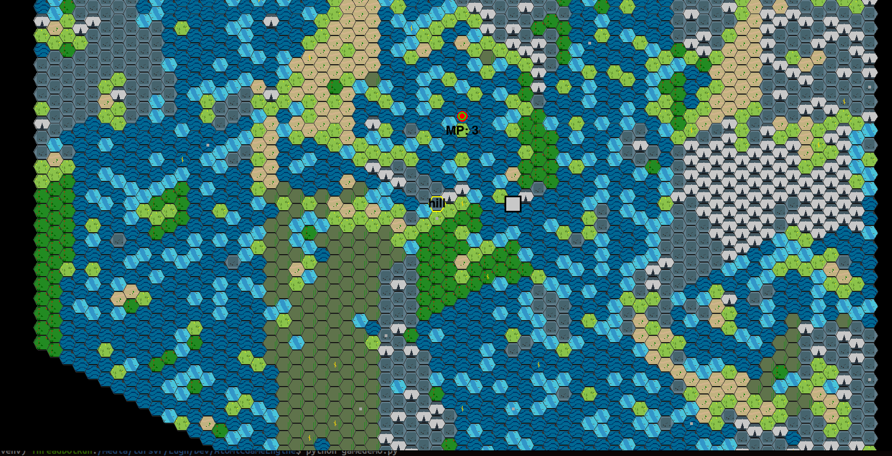

# AtomicGameEngine v1.0.0 🎮

AtomicGameEngine is a Python-based game engine for creating hexagonal grid-based strategy games. It provides a robust framework for managing game entities, combat, pathfinding, and coordinate systems with persistence. 🚀

## Table of Contents 📜
- [Overview](#overview) 🌟
- [Project Structure](#project-structure) 📂
- [Key Components](#key-components) 🔧
- [Setup Instructions](#setup-instructions) ⚙️
- [Testing](#testing) ✅
- [API Reference](#api-reference) 📚
- [Contributing](#contributing) 🤝
- [License](#license) 📝



## Overview 🌟
AtomicGameEngine is designed to facilitate the development of turn-based strategy games with a focus on hexagonal grid systems. It includes features such as:
- 🗺️ Hexagonal coordinate system management
- 👥 Entity and unit management
- ⚔️ Combat system with status effects
- 🛤️ Pathfinding using A* algorithm
- 💾 Persistence layer for saving game states
- ⛰️ Terrain and resource management
- 📚 API summarization for code documentation

## Project Structure 📂
The project uses a flat structure with all files in the root directory:

```
AtomicGameEngine/
|-- APISummarizer.py        # 📝 Summarizes project APIs (new)
|-- City.py                 # 🏰 City entity management
|-- CombatSystem.py         # ⚔️ Handles combat mechanics
|-- Config.py               # ⚙️ Configuration settings
|-- CoordinateSystem.py     # 🗺️ Manages hex grid coordinates
|-- CoordinateSystemDML.py  # 🔍 Data manipulation for coordinates
|-- CoordinateSystemInfo.md # 📜 Coordinate system documentation
|-- CoordinateSystemPersistence.py  # 💾 Persists coordinate data
|-- CoordinateSystemVersion.md  # 📜 Version info for coordinate system
|-- CodeEnumerator.py       # 🔎 Codebase analysis tool (new)
|-- Entity.py               # 🧑 Base entity class
|-- gamedemo.py             # 🎮 Game demo implementation
|-- HexMap.py               # 🌍 Hex map generation and management
|-- HexUtils.py             # 🔢 Hex grid utilities
|-- Pathfinding.py          # 🛤️ A* pathfinding implementation
|-- ResourceType.py         # 🪙 Resource type definitions
|-- terrain_config.json     # ⛰️ Terrain configuration file
|-- TerrainType.py          # ⛰️ Terrain type definitions
|-- TestCoordinateSystem.py # ✅ Tests coordinate system
|-- TestCoordinateSystemDML.py  # ✅ Tests coordinate DML
|-- TestCoordinateSystemPersistence.py  # ✅ Tests persistence
|-- TestEntity.py           # ✅ Tests entity behaviors
|-- Unit.py                 # 👷 Unit entity management
|-- Unit_test_CombatSystem.py  # ✅ Tests combat system
```

**Note**: Total files: 24 (19 Python, 2 Markdown, 1 JSON). New files (`APISummarizer.py`, `CodeEnumerator.py`) have been added since the older structure.

## Key Components 🔧
- **CoordinateSystem**: Manages entities and static geometry on a hexagonal grid, supporting up to 1000x1000 hexes with axial coordinates (q, r). 🗺️
- **HexUtils**: Provides utilities for converting between hex and cartesian coordinates, and rendering hex-based visuals. 🔢
- **CombatSystem**: Handles combat mechanics, including health, attack, defense, and status effects. ⚔️
- **Pathfinding**: Implements A* algorithm for efficient pathfinding on hex grids. 🛤️
- **CoordinateSystemPersistence**: Saves and loads game state to/from a database, supporting up to 10,000 entities by default. 💾
- **Entity/Unit/City**: Core classes for game objects with position and behavior management. 👥🏰
- **HexMap**: Generates and manages the game world map with terrain rules, defaulting to 100x100 hexes. 🌍
- **APISummarizer**: Generates summaries of the project’s API for documentation. 📝

## Setup Instructions ⚙️
1. **Clone the Repository** 📥:
   ```bash
   git clone https://github.com/username/AtomicGameEngine.git
   cd AtomicGameEngine
   ```

2. **Install Dependencies** 🛠️:
   Ensure Python 3.8+ is installed. Install required packages:
   ```bash
   pip install -r requirements.txt
   ```
   ℹ️ Note: Create a `requirements.txt` with dependencies like `pygame>=2.5.2`, `sqlite3` (built-in with Python), etc., if not already present.

3. **Run the Demo** 🎉:
   Launch the game demo:
   ```bash
   python gamedemo.py
   ```

4. **Run Tests** ✅:
   Execute the test suite:
   ```bash
   python -m unittest discover .
   ```

## Testing ✅
The project includes 5 unit test files in the root directory, covering approximately 50 test cases (estimated). Key test files include:
- `TestCoordinateSystem.py`: Tests coordinate system functionality. 🗺️
- `TestCoordinateSystemPersistence.py`: Tests persistence layer. 💾
- `Unit_test_CombatSystem.py`: Tests combat mechanics. ⚔️
- `TestEntity.py`: Tests entity behaviors. 👥
- `TestCoordinateSystemDML.py`: Tests data manipulation layer. 🔍

Run tests using:
```bash
python -m unittest discover .
```

## API Reference 📚
Below is a summary of the key classes and their methods to help developers integrate AtomicGameEngine into their applications.

### `APISummarizer` 📝
Manages API summarization for project documentation.

- **Constructor**:
  ```python
  APISummarizer(root, output_file)
  ```
  Initializes with the root directory and output file path.

- **Methods**:
  ```python
  summarize()  # Generates API summary
  _generate_tree()  # Builds project directory tree
  _summarize_python_files()  # Summarizes Python files
  _summarize_ast(path, node)  # Analyzes AST for a file
  _format_function_signature(func)  # Formats function signatures
  _write_output(tree, summary)  # Writes summary to output file
  ```

### `Config` ⚙️
Handles configuration settings for the game engine.

- **Constructor**:
  ```python
  Config()
  ```
  Initializes configuration settings.

### `CoordinateSystemPersistence` 💾
Persists coordinate system data to a database, supporting up to 10,000 entities by default.

- **Constructor**:
  ```python
  CoordinateSystemPersistence(db_name)
  ```
  Initializes with database name.

- **Methods**:
  ```python
  init_tables()  # Creates database tables
  save_coordinate_system(cs)  # Saves coordinate system state
  load_coordinate_system()  # Loads coordinate system state
  ```

### `HexUtils` 🔢
Provides utilities for hexagonal grid operations.

- **Methods** (static):
  ```python
  hex_to_cartesian(q, r, size)  # Converts hex to cartesian coordinates
  cartesian_to_hex(x, y, size)  # Converts cartesian to hex coordinates
  hex_to_pixel(pos, offset)  # Converts hex to pixel coordinates
  pixel_to_hex(x, y, size, offset)  # Converts pixel to hex coordinates
  get_hex_vertices(q, r, size)  # Returns vertices for a hex
  draw_hex(surface, pos, size, terrain, offset)  # Draws a hex tile
  draw_unit(surface, pos, size, unit, offset)  # Draws a unit
  draw_city(surface, pos, size, city, offset)  # Draws a city
  draw_resource(surface, pos, size, resource, offset)  # Draws a resource
  ```

### `CombatSystem` ⚔️
Manages combat mechanics and status effects, with a default attack range of 3 hexes.

- **Constructor**:
  ```python
  CombatSystem(cs, dml, persistence)
  ```
  Initializes with coordinate system, data manipulation layer, and persistence.

- **Methods**:
  ```python
  init_combat_table()  # Initializes combat database table
  update_combat_attributes(entity_id, health, attack_power, defense, status_effects)  # Updates combat attributes
  get_combat_attributes(entity_id)  # Retrieves combat attributes
  find_targets_in_range(attacker_id, attack_range)  # Finds targets within range (default: 3 hexes)
  resolve_combat(attacker_id, defender_id)  # Resolves combat outcome
  initiate_combat(attacker_id, target_id)  # Starts combat
  apply_status_effect(entity_id, effect, duration)  # Applies status effect
  update_status_effects(entity_id)  # Updates active status effects
  ```

### `Unit` 👷
Represents a game unit with position and behavior.

- **Constructor**:
  ```python
  Unit(entity_id, position, cs, dml, persistence, name)
  ```
  Initializes with entity ID, position, coordinate system, data manipulation layer, persistence, and name.

- **Methods**:
  ```python
  update()  # Updates unit state
  ```

### `Entity` 🧑
Base class for game entities.

- **Constructor**:
  ```python
  Entity(entity_id, position, coordinate_system, dml, persistence)
  ```
  Initializes with entity ID, position, coordinate system, data manipulation layer, and persistence.

- **Methods**:
  ```python
  entity_id()  # Returns entity ID
  position()  # Returns current position
  update_position(new_position)  # Updates entity position
  remove()  # Removes entity
  get_nearby_entities(min_coords, max_coords)  # Lists nearby entities
  find_nearest_entity(type_prefix)  # Finds nearest entity by type
  is_near_geometry(category, max_distance)  # Checks proximity to geometry
  save_state()  # Saves entity state
  update()  # Updates entity state
  __str__()  # Returns string representation
  ```

### `Pathfinding` 🛤️
Implements A* pathfinding for hex grids.

- **Methods** (static):
  ```python
  hex_distance(a, b)  # Calculates hex distance
  get_neighbors(pos, cs, dml)  # Returns neighboring hexes
  a_star(start, goal, cs, dml)  # Computes A* path
  ```

### `CodeEnumerator` 🔎
Analyzes codebase for documentation.

- **Constructor**:
  ```python
  CodeEnumerator(root_dir, additional_types)
  ```
  Initializes with root directory and additional types.

- **Methods**:
  ```python
  _load_gitignore()  # Loads gitignore patterns
  _is_ignored(path)  # Checks if path is ignored
  get_relevant_files(filter_string)  # Returns relevant files
  build_tree()  # Builds directory tree
  print_tree(node, indent)  # Prints directory tree
  get_code_blocks()  # Extracts code blocks
  generate_output()  # Generates output
  ```

### `CoordinateSystemDML` 🔍
Handles data manipulation for coordinate systems.

- **Constructor**:
  ```python
  CoordinateSystemDML(conn)
  ```
  Initializes with database connection.

- **Methods**:
  ```python
  count_entities(type_prefix)  # Counts entities by type
  list_entities_in_bounding_box(min_coords, max_coords)  # Lists entities in area
  find_nearest_entity(point, type_prefix, max_distance)  # Finds nearest entity
  list_geometry_by_category(category)  # Lists geometry by category
  is_entity_near_geometry(entity_id, category, max_distance)  # Checks proximity
  ```

### `ResourceType` 🪙
Manages resource type definitions.

- **Methods** (static):
  ```python
  init_sprites()  # Initializes resource sprites
  ```

### `Game` 🎮
Main game class for demo.

- **Constructor**:
  ```python
  Game()
  ```
  Initializes the game.

- **Methods**:
  ```python
  end_turn()  # Ends current turn
  ```

### `City` 🏰
Represents a city entity.

- **Constructor**:
  ```python
  City(entity_id, position, cs, dml, persistence, name)
  ```
  Initializes with entity ID, position, coordinate system, data manipulation layer, persistence, and name.

- **Methods**:
  ```python
  update()  # Updates city state
  ```

### `CoordinateSystem` 🗺️
Manages entities and geometry on a hex grid, supporting up to 1000x1000 hexes.

- **Constructor**:
  ```python
  CoordinateSystem()
  ```
  Initializes the coordinate system.

- **Methods**:
  ```python
  add_entity(entity_id, position)  # Adds an entity
  remove_entity(entity_id)  # Removes an entity
  update_entity_position(entity_id, new_position)  # Updates entity position
  get_entity_position(entity_id)  # Returns entity position
  get_all_entity_positions()  # Returns all entity positions
  add_static_polygon(geometry_id, vertices, category)  # Adds static geometry
  get_static_geometry(geometry_id)  # Returns geometry
  list_static_geometry_by_category(category)  # Lists geometry by category
  list_all_static_geometry()  # Lists all geometry
  ```

### `HexMap` 🌍
Generates and manages hex-based game maps, defaulting to 100x100 hexes.

- **Constructor**:
  ```python
  HexMap(width, height, cs, persistence)
  ```
  Initializes with map width, height, coordinate system, and persistence.

- **Methods**:
  ```python
  get_neighbors(q, r)  # Returns neighboring hexes
  apply_terrain_rules(q, r, terrain)  # Applies terrain rules
  generate_map()  # Generates the map
  ```

### `TerrainType` ⛰️
Manages terrain type definitions.

- **Methods** (static):
  ```python
  load_config(config_path)  # Loads terrain configuration
  init_sprites()  # Initializes terrain sprites
  ```

## Contributing 🤝
Contributions are welcome! 🎉 Please follow these steps:
1. Fork the repository. 🍴
2. Create a feature branch (`git checkout -b feature-name`). 🌿
3. Commit changes (`git commit -m "Add feature"`). 💾
4. Push to the branch (`git push origin feature-name`). 🚀
5. Open a pull request. 📬

## License 📝
This project is licensed under the MIT License. See the `LICENSE` file for details. ✅